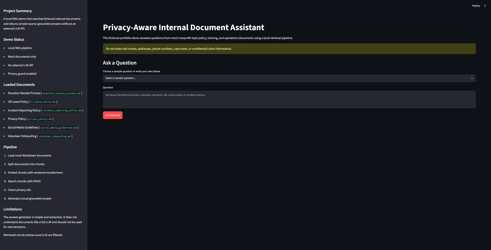
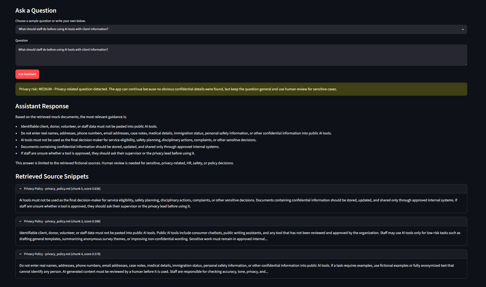
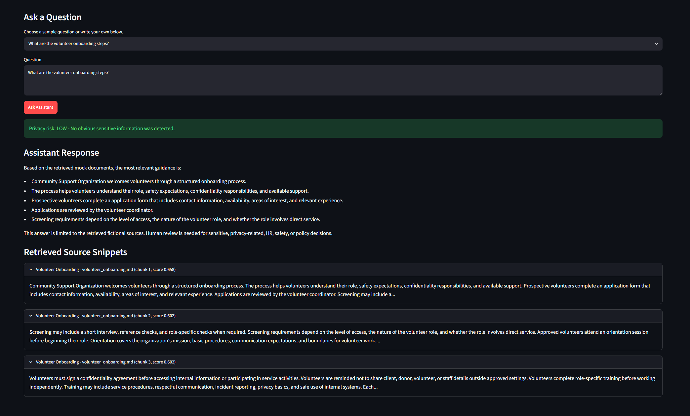
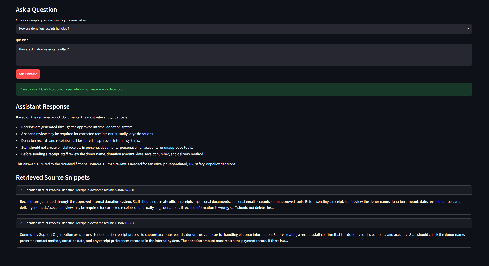
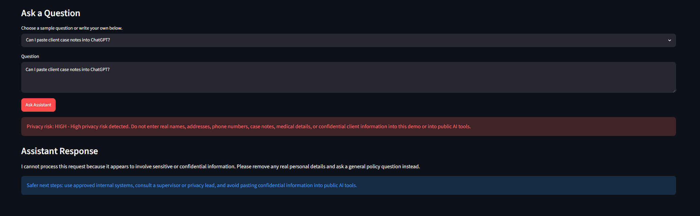

# Privacy-Aware Internal Document Assistant

## Project Overview

A local Streamlit demo that answers questions from fictional internal policy, training, and operations documents using retrieval-augmented generation concepts.

This project demonstrates practical AI workflow prototyping, local document retrieval, and privacy-conscious design for internal policy search. It uses source-based responses so users can review the mock documents behind each answer.

This is a fictional demo. It uses mock documents only and is not affiliated with any real organization.

## Project Status

- Working local Streamlit demo
- Mock documents only
- No external LLM API
- No OpenAI API key required
- No real client, donor, staff, volunteer, or nonprofit data

## Screenshots

### Home



### Privacy Guidance



### Volunteer Onboarding



### Donation Receipts



### High-Risk Refusal



## Features

- Loads fictional Markdown documents from `mock_documents/`.
- Ignores `mock_documents/sample_questions.md` during retrieval because it is an example helper file.
- Splits documents into readable paragraph-based chunks.
- Creates local embeddings with `sentence-transformers`.
- Builds a FAISS vector index for local similarity search.
- Filters low-relevance retrieved chunks using a similarity score threshold.
- Checks user questions for privacy risk before retrieval.
- Refuses high-risk requests that appear to involve confidential client data.
- Displays a simple source-grounded answer with retrieved source snippets and scores.
- Runs locally without an OpenAI API key or external LLM API.

## How The Local RAG Pipeline Works

1. `document_loader.py` loads fictional Markdown source documents.
2. `chunker.py` removes document headings and splits body text into paragraph-based chunks.
3. `embeddings.py` creates normalized embeddings with `all-MiniLM-L6-v2`.
4. `vector_store.py` stores chunk embeddings in a FAISS inner-product index.
5. The Streamlit app embeds the user's question.
6. FAISS retrieves the most similar chunks.
7. Chunks below the similarity threshold are filtered out, with a best-match fallback.
8. `answer_generator.py` creates a simple extractive answer from the retrieved chunks.
9. The app displays the answer, source snippets, filenames, chunk numbers, and similarity scores.

## Privacy-Aware Design

The app checks each question before retrieval. It looks for high-risk patterns such as email addresses, phone numbers, client case notes, full names, addresses, personal safety details, medical details, immigration status, confidential information, and requests to paste sensitive content into ChatGPT or public AI tools.

High-risk prompts are refused before retrieval. Medium-risk prompts show a warning but continue if no obvious confidential details are present. Low-risk prompts continue normally.

Users should not enter real names, addresses, phone numbers, case notes, medical details, immigration status, personal safety information, or confidential client information into this demo.

## Project Structure

```text
privacy-aware-document-assistant/
|-- README.md
|-- requirements.txt
|-- .gitignore
|-- app.py
|-- rag/
|   |-- __init__.py
|   |-- document_loader.py
|   |-- chunker.py
|   |-- embeddings.py
|   |-- vector_store.py
|   |-- privacy_guard.py
|   `-- answer_generator.py
|-- mock_documents/
|   |-- privacy_policy.md
|   |-- volunteer_onboarding.md
|   |-- donation_receipt_process.md
|   |-- hr_leave_policy.md
|   |-- social_media_guidelines.md
|   |-- incident_reporting_policy.md
|   `-- sample_questions.md
`-- screenshots/
    |-- home.png
    |-- privacy_guidance.png
    |-- volunteer_onboarding.png
    |-- donation_receipts.png
    |-- high_risk_refusal.png
    `-- .gitkeep
```

## Setup Instructions

Create and activate a virtual environment:

```bash
python -m venv .venv
```

On Windows PowerShell:

```bash
.venv\Scripts\Activate.ps1
```

On macOS or Linux:

```bash
source .venv/bin/activate
```

Install dependencies:

```bash
pip install -r requirements.txt
```

Run the app:

```bash
python -m streamlit run app.py
```

The first run may take time because `sentence-transformers` downloads the `all-MiniLM-L6-v2` model.

## Tested Demo Questions

- What should staff do before using AI tools with client information?
  Expected behavior: The app should show privacy-related guidance from the mock privacy policy, including avoiding identifiable client data in public AI tools and using human review.
- What are the volunteer onboarding steps?
  Expected behavior: The app should retrieve onboarding guidance such as application, screening, orientation, confidentiality agreement, training, and supervisor check-in.
- How are donation receipts handled?
  Expected behavior: The app should retrieve donation receipt steps such as verifying donor records, confirming donation amount, generating receipts, reviewing before sending, correcting errors, and storing records securely.
- Can I paste client case notes into ChatGPT?
  Expected behavior: The privacy guard should mark this as high risk and refuse to retrieve or answer using the document index.

More example questions are available in `mock_documents/sample_questions.md`.

## Limitations

- This is a fictional educational portfolio project, not a production system.
- It does not use real nonprofit data.
- It is not affiliated with any real organization.
- The answer generator is simple and extractive, not a full conversational LLM.
- Retrieval quality depends on the wording of the question and the available mock documents.
- The similarity threshold can filter weak matches, but borderline chunks may still be included or excluded.
- Privacy checks use basic regex and keyword rules, not a complete data loss prevention system.
- Human review is still required for privacy, HR, safety, finance, or policy-sensitive decisions.

## Troubleshooting

If FAISS install fails:

- Use a supported Python version such as Python 3.10, 3.11, or 3.12.
- Some systems may not have `faiss-cpu` wheels for the newest Python versions.

If the sentence-transformers model download takes time:

- This is expected on the first run.
- Keep the internet connection open while the model downloads.
- Later runs should use the cached model.

If `streamlit` is not recognized:

- Make sure the virtual environment is activated.
- Run the app with `python -m streamlit run app.py`.
- Confirm dependencies were installed with `pip install -r requirements.txt`.

If Python version issues happen:

- Check your version with `python --version`.
- Use Python 3.10, 3.11, or 3.12 for best package compatibility.

## Skills Demonstrated

- Retrieval-augmented document search over mock policy, training, and operations documents.
- Document loading, paragraph-based chunking, embeddings, FAISS vector search, and similarity-threshold filtering for relevant source snippets.
- Privacy-conscious safeguards, including sensitive-information warnings, risk classification, and refusal behavior for high-risk client-data requests.
- Internal staff workflow design for quickly locating policy guidance without manually searching long documents.
- Clear setup instructions, usage guidelines, limitations, and responsible-use documentation for safe AI-assisted document search.

## Disclaimer

This repository is a fictional portfolio demonstration. All documents are mock examples created for learning purposes. The project does not represent any real organization, policy, client, donor, staff member, volunteer, or operational process.

Do not enter real names, addresses, case notes, phone numbers, medical details, immigration status, personal safety information, or confidential client information into this demo or into public AI tools.
